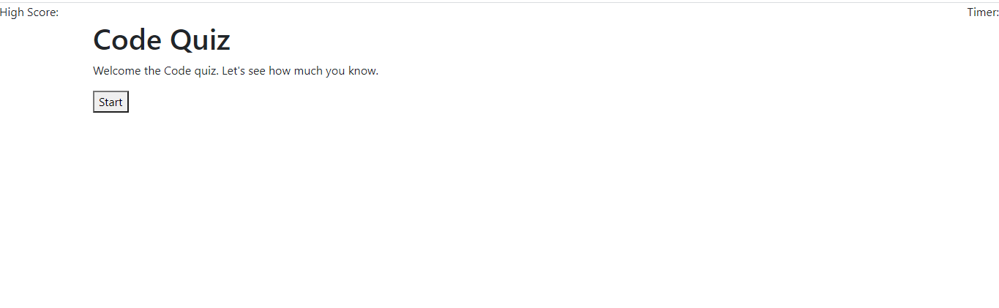

# Code Quiz

## Purpose

A website designed to help students quiz themselves on their coding knowledge and improve their retention. 

The user will have a set amount of time to answer the questions on the quiz. Once the quiz is completed they will be prompted to enter their initials to store their high score. 

## Built With

* HTML 
* Javascript

## Website

https://siwel20.github.io/code-quiz/ 

## Preview of the application

## Contribution

Created by Paul Throckmorton